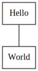

# Table of Contents

1.  [Emacs Tutorial](#org19eb7e8)
    1.  [Graphviz](#org4020c5d)
        1.  [dot 문법](#org6cbb41a)
        2.  [예제 받아 출력](#org2b5c231)

# Emacs Tutorial

## Graphviz

### dot 문법

기본적으로 json형식 같이 key value 형식과 유사하며 키에 분포적인 정의가 가미된 형태다.
[]안의 요소는 선택적인 옵션을 ()안의 요소는 필요로 되는 요소들의 묶음. | 는 대체할 수 있는 요소를 표현.

1.  Simple Diagraph

### 예제 받아 출력

<table id="org617ef2a" border="2" cellspacing="0" cellpadding="6" rules="groups" frame="hsides">

<colgroup>
<col  class="org-left" />

<col  class="org-left" />
</colgroup>
<tbody>
<tr>
<td class="org-left">a</td>
<td class="org-left">Hello</td>
</tr>

<tr>
<td class="org-left">b</td>
<td class="org-left">World</td>
</tr>
</tbody>
</table>

위의 테이블을 다이어그램으로 변환한다.

    (mapcar `(lambda (x)
              (princ (format "%s [label =\"%s\", shape = \"box\"\];\n" 
                            (first x) (second x)))) table)
              (princ (format "%s -- %s;\n" 
                            (first (first table)) (first (second table))))

테이블을 graphviz 형식으로 변경하는 코드

변형의 결과값

입력 받은 형식을 통해 다이어그램 이미지를 생성한다.

다이어그램 변환 결과

1.  dot 구문을 이용한 출력
    
    

