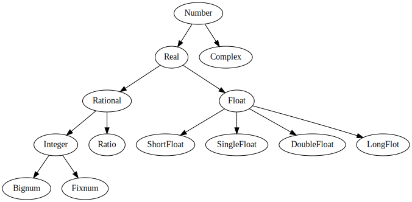

# Table of Contents

1.  [Emacs tutorial](#org32fec11)
    1.  [Graphviz](#org271ee7b)
        1.  [dot 문법](#org4de6336)
        2.  [예제 받아 출력](#org9f5dda2)
2.  [Lisp](#org5c972cd)
    1.  [구조](#org1e4a4ad)
        1.  [프로그래밍 언어적 특징들](#orgb31566c)
        2.  [Naming Convention](#orgbbe3ac3)
    2.  [자료형](#orgbd66f95)
        1.  [자료형 표](#org77b2d5b)
    3.  [Macro](#org0f253b8)
    4.  [변수](#org7d097b9)
    5.  [연산자](#org8f6d523)
        1.  [산술 연산자](#org55e8fd7)
        2.  [비교 연산자](#org0e935f8)
        3.  [논리연산자](#org1ca2f87)
        4.  [이진 연산자](#org839c303)
    6.  [조건문](#orgc836a9c)
        1.  [cond](#orgc5a0819)
        2.  [if](#org9abe32a)
        3.  [when](#orgc88e6a8)
        4.  [case](#org224ebed)
    7.  [반복문](#org2bf93b9)
        1.  [loop](#org239fa34)
        2.  [loop for](#orgd7e0861)
        3.  [do](#org5570324)
        4.  [dotimes](#orgdb5c78d)
        5.  [dolist](#org63b0109)
    8.  [함수](#orgc027027)
    9.  [숫자 체계](#orge02982b)

# Emacs tutorial

## Graphviz

### dot 문법

기본적으로 json형식 같이 key value 형식과 유사하며 키에 분포적인 정의가 가미된 형태다.
[]안의 요소는 선택적인 옵션을 ()안의 요소는 필요로 되는 요소들의 묶음. | 는 대체할 수 있는 요소를 표현.

1.  Simple Diagraph
    
        /* 
        graph: (graph | diagraph) [ID] 그래프의 형식을 선언하며 ID를 정의할 수 있다.
        {}: 그래프를 구성하는 요소들을 정의하는 부분 
        */
          graph { 
            a -- b;
          }
    
    

### 예제 받아 출력

<table id="orgae16149" border="2" cellspacing="0" cellpadding="6" rules="groups" frame="hsides">

<colgroup>
<col  class="org-left" />

<col  class="org-left" />
</colgroup>
<tbody>
<tr>
<td class="org-left">a</td>
<td class="org-left">Hello</td>
</tr>

<tr>
<td class="org-left">b</td>
<td class="org-left">World</td>
</tr>
</tbody>
</table>

위의 테이블을 다이어그램으로 변환한다.

    (mapcar `(lambda (x)
              (princ (format "%s [label =\"%s\", shape = \"box\"\];\n" 
                            (first x) (second x)))) table)
              (princ (format "%s -- %s;\n" 
                            (first (first table)) (first (second table))))

테이블을 graphviz 형식으로 변경하는 코드

    a [label ="Hello", shape = "box"];
    b [label ="World", shape = "box"];
    a -- b

변형의 결과값

    graph {
      $input
    }

입력 받은 형식을 통해 다이어그램 이미지를 생성한다.

다이어그램 변환 결과

1.  dot 구문을 이용한 출력
    
        digraph G {
          my_start -> one_branch;
          my_start -> another_branch;
        }
    
    

# Lisp

lisp을 배움으로 다양한 작업들을 자동화 할 수 있다. 일반적으로 vim을 사용할 때는 배쉬 쉘을 사용하듯
emacs를 사용할 때에는 elips을 사용하여 작업을 수행한다. 두번째로 오래된 고수준 언어답게 언어의 완성도가 높으며
다양하고 편리한 함수들이 이미 많이 구축되있다.

## 구조

lisp의 표현법은 symbolic expressions(s-expressions)로 불린다.
s-epxressions는 objects, atoms, lists 세 가지 요소로 구성되는 표현법이다.

    (+ 7 9 11)

    27

위 예제는 세 숫자를 모두 더하는 예제다.
더하기 기호는 더하는 함수를 그 뒤에 세 숫자는 매개변수임을 알 수 있다.

    (+ (* (/ 9 5) 60) 32)

    92

위 예제의 수식은 일반적인 중위 표현 방식으로는 (60 \* 9 / 5) + 32 다.
이를 전위 표현으로 바꾸면 + \* / 9 5 60 32 가 된다. lisp의 표현방식은 전위 표현 방식임을 알 수 있다.
문맥을 좀 더 알아보기 위해 위에 언급한 세가지 문법범주를 알아보자.

-   atom ( 문자열 )
-   list ( 괄호열로 구분된 atom들의 집합체 )
-   string ( 큰 따옴표로 구분된 문자열 )

    (princ "string 출력\n")
    (princ (format "atom %d 출력" 1))

    string 출력
    atom 1 출력

### 프로그래밍 언어적 특징들

-   산술 연산자는 +, -, \*, /
-   함수 f(x)는 (f x)로 표현된다.
-   표현식에서 대문자 소문자는 동일 취급한다.
-   상수적 혹은 primary 타입같은 요소는 오직 세가지 존재하며 숫자, t, nil이다.(t = true, nil = false)

### Naming Convention

-   white-space, (), ", ', \`, ;, :, | 를 제외한 모든 문자를 함수명으로 사용할 수 있다.
-   \`는 코드 이스케이프 역할을 수행하며 \`뒤에 list는 atom으로 해석된다.

    (princ (+ 3 3))
    (princ "\n")
    (princ `(+ 3 3))

    6
    (+ 3 3)

## 자료형

lisp의 변수는 동적인 자료형을 따름으로 대부분은 객체로 표현된다. 하지만 객체화된 자료도 범주를 갖고있다.

-   Scala types - number, character, symbol
-   Data structures - list, vector, bit-vector, string

자료형을 확인하는 함수로 ~typep~와 ~type-of~가 있다.

    (prin1 (typep 10 `integer))
    (print (typep t `integer))
    (prin1 (typep t t))
    (print (typep nil t))
    (prin1 (typep nil nil))
    (print (type-of nil))
    (prin1 (type-of t))
    (print (type-of 12))

    t
    nil
    t
    t
    nil
    symbol
    symbol
    integer

typep 함수는 변수의 자료형을 확인하여 일치시 t 일치하지 않으면 nil을 반환하고 type-of는 어떤 자료형인지를 반환한다.
위에서 주의할 것이 있는데 nil의 자료형이다. t일 경우 t를 반환하지만 nil일 경우 nil을 반환하다.

### 자료형 표

<table border="2" cellspacing="0" cellpadding="6" rules="groups" frame="hsides">

<colgroup>
<col  class="org-left" />

<col  class="org-left" />

<col  class="org-left" />

<col  class="org-left" />
</colgroup>
<thead>
<tr>
<th scope="col" class="org-left">array</th>
<th scope="col" class="org-left">fixnum</th>
<th scope="col" class="org-left">package</th>
<th scope="col" class="org-left">simple-string</th>
</tr>
</thead>

<tbody>
<tr>
<td class="org-left">atom</td>
<td class="org-left">float</td>
<td class="org-left">pathname</td>
<td class="org-left">simple-vector</td>
</tr>

<tr>
<td class="org-left">bignum</td>
<td class="org-left">function</td>
<td class="org-left">random-state</td>
<td class="org-left">single-float</td>
</tr>

<tr>
<td class="org-left">bit</td>
<td class="org-left">hash-table</td>
<td class="org-left">ratio</td>
<td class="org-left">standard-char</td>
</tr>

<tr>
<td class="org-left">bit-vector</td>
<td class="org-left">integer</td>
<td class="org-left">rational</td>
<td class="org-left">stream</td>
</tr>

<tr>
<td class="org-left">character</td>
<td class="org-left">keyword</td>
<td class="org-left">readtable</td>
<td class="org-left">string</td>
</tr>

<tr>
<td class="org-left">[common]</td>
<td class="org-left">list</td>
<td class="org-left">sequence</td>
<td class="org-left">[string-char]</td>
</tr>

<tr>
<td class="org-left">compiled-function</td>
<td class="org-left">long-float</td>
<td class="org-left">short-float</td>
<td class="org-left">symbol</td>
</tr>

<tr>
<td class="org-left">complex</td>
<td class="org-left">nill</td>
<td class="org-left">signed-byte</td>
<td class="org-left">t</td>
</tr>

<tr>
<td class="org-left">cons</td>
<td class="org-left">null</td>
<td class="org-left">simple-array</td>
<td class="org-left">unsigned-byte</td>
</tr>

<tr>
<td class="org-left">double-float</td>
<td class="org-left">number</td>
<td class="org-left">simple-bit-vector</td>
<td class="org-left">vector</td>
</tr>
</tbody>
</table>

## Macro

매크로를 통해 lisp의 문법을 변경할 수 있다.

    (defmacro setTo10(num)
    (setq num 10)(print num))
    (setTo10 25)

    10

## 변수

lisp에서는 변수를 심볼로 표현한다.

전역변수의 선언 방식

    (defvar x 234)
    (print x)

    234

    (setq x 10)
    (print x)

    10

지역변수의 선언방식

    (let ((x `a) (y `b)) (prin1 (format "%s %s" x y)))

    "a b"

상수의 선언 방식

    (defconst PI 3.141592)
    (prin1 PI)

    3.141592

## 연산자

### 산술 연산자

<table border="2" cellspacing="0" cellpadding="6" rules="groups" frame="hsides">

<colgroup>
<col  class="org-left" />

<col  class="org-left" />

<col  class="org-left" />
</colgroup>
<thead>
<tr>
<th scope="col" class="org-left">Operator</th>
<th scope="col" class="org-left">Description</th>
<th scope="col" class="org-left">Example</th>
</tr>
</thead>

<tbody>
<tr>
<td class="org-left">+</td>
<td class="org-left">Adds two operands</td>
<td class="org-left">(+A B) will give 30</td>
</tr>

<tr>
<td class="org-left">-</td>
<td class="org-left">Subtracts second operand from the first</td>
<td class="org-left">(- A B) will give -10</td>
</tr>

<tr>
<td class="org-left">\*</td>
<td class="org-left">Multiplies both operands</td>
<td class="org-left">(\* A B) will give 200</td>
</tr>

<tr>
<td class="org-left">mod,rem</td>
<td class="org-left">Modulus Operator and remainder of after an integer division</td>
<td class="org-left">(mod B A )will give 0</td>
</tr>

<tr>
<td class="org-left">incf</td>
<td class="org-left">Increments operator increases integer value by the second argument specified</td>
<td class="org-left">(incf A 3) will give 13</td>
</tr>

<tr>
<td class="org-left">decf</td>
<td class="org-left">Decrements operator decreases integer value by the second argument specified</td>
<td class="org-left">(decf A 4) will give 9</td>
</tr>
</tbody>
</table>

### 비교 연산자

<table border="2" cellspacing="0" cellpadding="6" rules="groups" frame="hsides">

<colgroup>
<col  class="org-left" />

<col  class="org-left" />

<col  class="org-left" />
</colgroup>
<thead>
<tr>
<th scope="col" class="org-left">Operator</th>
<th scope="col" class="org-left">Description</th>
<th scope="col" class="org-left">Example</th>
</tr>
</thead>

<tbody>
<tr>
<td class="org-left">=</td>
<td class="org-left">Checks if the values of the operands are all equal or not, if yes then condition becomes true.</td>
<td class="org-left">(= A B) is not true.</td>
</tr>

<tr>
<td class="org-left">/=</td>
<td class="org-left">Checks if the values of the operands are all different or not, if values are not equal then condition becomes true.</td>
<td class="org-left">(/= A B) is true.</td>
</tr>

<tr>
<td class="org-left">></td>
<td class="org-left">Checks if the values of the operands are monotonically decreasing.</td>
<td class="org-left">(> A B) is not true.</td>
</tr>

<tr>
<td class="org-left"><</td>
<td class="org-left">Checks if the values of the operands are monotonically increasing.</td>
<td class="org-left">(< A B) is true.</td>
</tr>

<tr>
<td class="org-left">>=</td>
<td class="org-left">Checks if the value of any left operand is greater than or equal to the value of next right operand, if yes then condition becomes true.</td>
<td class="org-left">(>= A B) is not true.</td>
</tr>

<tr>
<td class="org-left"><=</td>
<td class="org-left">Checks if the value of any left operand is less than or equal to the value of its right operand, if yes then condition becomes true.</td>
<td class="org-left">(<= A B) is true.</td>
</tr>

<tr>
<td class="org-left">max</td>
<td class="org-left">It compares two or more arguments and returns the maximum value.</td>
<td class="org-left">(max A B) returns 20</td>
</tr>

<tr>
<td class="org-left">min</td>
<td class="org-left">It compares two or more arguments and returns the minimum value.</td>
<td class="org-left">(min A B) returns 10</td>
</tr>
</tbody>
</table>

### 논리연산자

<table border="2" cellspacing="0" cellpadding="6" rules="groups" frame="hsides">

<colgroup>
<col  class="org-left" />

<col  class="org-left" />

<col  class="org-left" />
</colgroup>
<thead>
<tr>
<th scope="col" class="org-left">Operator</th>
<th scope="col" class="org-left">Description</th>
<th scope="col" class="org-left">Example</th>
</tr>
</thead>

<tbody>
<tr>
<td class="org-left">and</td>
<td class="org-left">It takes any number of arguments. The arguments are evaluated left to right. If all arguments evaluate to non-nil, then the value of the last argument is returned. Otherwise nil is returned.</td>
<td class="org-left">(and A B) will return NIL.</td>
</tr>

<tr>
<td class="org-left">or</td>
<td class="org-left">It takes any number of arguments. The arguments are evaluated left to right until one evaluates to non-nil, in such case the argument value is returned, otherwise it returns nil.</td>
<td class="org-left">(or A B) will return 5.</td>
</tr>

<tr>
<td class="org-left">not</td>
<td class="org-left">It takes one argument and returns t if the argument evaluates to nil.</td>
<td class="org-left">(not A) will return T.</td>
</tr>

<tr>
<td class="org-left">&#xa0;</td>
<td class="org-left">&#xa0;</td>
<td class="org-left">&#xa0;</td>
</tr>
</tbody>
</table>

### 이진 연산자

<table border="2" cellspacing="0" cellpadding="6" rules="groups" frame="hsides">

<colgroup>
<col  class="org-left" />

<col  class="org-left" />

<col  class="org-left" />
</colgroup>
<thead>
<tr>
<th scope="col" class="org-left">Operator</th>
<th scope="col" class="org-left">Description</th>
<th scope="col" class="org-left">Example</th>
</tr>
</thead>

<tbody>
<tr>
<td class="org-left">logand</td>
<td class="org-left">This returns the bit-wise logical AND of its arguments. If no argument is given, then the result is -1, which is an identity for this operation.</td>
<td class="org-left">(logand a b)) will give 12</td>
</tr>

<tr>
<td class="org-left">logior</td>
<td class="org-left">This returns the bit-wise logical INCLUSIVE OR of its arguments. If no argument is given, then the result is zero, which is an identity for this operation.</td>
<td class="org-left">(logior a b) will give 61</td>
</tr>

<tr>
<td class="org-left">logxor</td>
<td class="org-left">This returns the bit-wise logical EXCLUSIVE OR of its arguments. If no argument is given, then the result is zero, which is an identity for this operation.</td>
<td class="org-left">(logxor a b) will give 49</td>
</tr>

<tr>
<td class="org-left">lognor</td>
<td class="org-left">This returns the bit-wise NOT of its arguments. If no argument is given, then the result is -1, which is an identity for this operation.</td>
<td class="org-left">(lognor a b) will give -62,</td>
</tr>

<tr>
<td class="org-left">logeqv</td>
<td class="org-left">This returns the bit-wise logical EQUIVALENCE (also known as exclusive nor) of its arguments. If no argument is given, then the result is -1, which is an identity for this operation.</td>
<td class="org-left">(logeqv a b) will give -50</td>
</tr>
</tbody>
</table>

## 조건문

### cond

    (setq a 10)
    (cond 
    ((> a 20) (prin1 "smaller"))
    ((< a 20) (prin1 "bigger")))

    "bigger"

조건들에 따라 시행되는 form의 연속

### if

    (setq a 10)
    (if (> a 20) (print "bigger") (print "smaller"))

    
    "smaller"

첫번째 boolean값에 참이면 두 번째 변수를 거짓이면 세번째 변수를 실행한다.

### when

    (setq a 100)
    (when (> a 20) (print "bigger"))

    
    "bigger"

if와 달리 조건문이 참일 경우에 만 실행한다.

### case

    (setq day 4)
    (case day
      (1 (prin1 "Monday"))
      (2 (prin1 "Tuesday"))
      (3 (prin1 "Wednseday")) 
      (4 (prin1 "Friday"))
      (5 (prin1 "Saturday"))
      (6 (prin1 "Sunday")))

    Friday

## 반복문

### loop

    (setq a 1)
    (loop
      (setq a (+ a 1))
      (when (>= a 10) (return a)))

    10

### loop for

    (loop for x in `(a b c)
      do (prin1 x))

    abc

    (loop for x from 10 to 20
      do (princ (format "%d " x)))

    10 11 12 13 14 15 16 17 18 19 20 

    (loop for x from 1 to 20
      if(evenp x) do (princ (format "%d " x)))

    2 4 6 8 10 12 14 16 18 20 

### do

    (do 
      ((x 0 (+ 2 x)) (y 20 (- y 2)))
      ((= x y)(- x y))
      (princ (format "x=%d y=%d\n" x y)))

    x=0 y=20
    x=2 y=18
    x=4 y=16
    x=6 y=14
    x=8 y=12

do는 얼핏 보면 생소한 반복문 처럼 보이지만 do while문과 흡사하다.
do의 두번째 즉 (do (이 부분) 의 값은 변수와 변수의 변화를 정의하는 부분이다.
(x 0 (+ 2 x))는 즉 x에 초기값 0을 할당하고 이후에는 2씩 증가함을 뜻한다.
((= x y) (- x y)) 이 부분은 반복시에 값을 검증하여 조건에 부합하면 반복이 종료된다.

### dotimes

    (dotimes (n 11)
    (princ n) (princ (format "-%d " (* n n))))

    0-0 1-1 2-4 3-9 4-16 5-25 6-36 7-49 8-64 9-81 10-100 

### dolist

    (dolist (n `(1 2 3 4 5 6 7 8 9))
      (princ (format "%d " (* n n))))

    1 4 9 16 25 36 49 64 81 

**우아한 블럭 종결 문제**
javascript 처럼 콜백 체인 형식의 언어 페러다임에서 반환값을 예측하는 것은 매우 힘든일이다.

    (defun block-test (flag)
    (block first
      (prin1 (block inner-first
        (if flag 
          (return-from first `outer)
          (return-from inner-first `inner)
        )
      ))
    t))
    (block-test t)
    (block-test nil)

    inner

## 함수

    (defun averageNum (n1 n2 n3)
      (/ (+ n1 n2 n3) 3))
    (averageNum 3 3 3)

    3

## 숫자 체계

lisp은 수학 체계를 잘 구현한 언어이다.

    digraph NumberSystem {
    Number -> {Real Complex};
    Real -> {Rational Float};
    Rational -> {Integer Ratio};
    Integer -> {Bignum Fixnum};
    Float -> {ShortFloat SingleFloat DoubleFloat LongFlot};
    }

