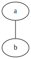
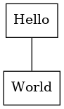
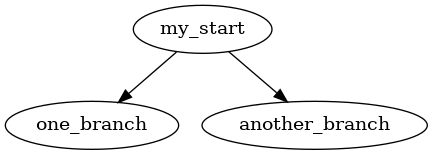

# Table of Contents

1.  [Emacs tutorial](#orgd5527d9)
    1.  [Graphviz](#orgf23daea)
        1.  [dot 문법](#orgb6a5b31)
        2.  [예제 받아 출력](#org0dfea38)
2.  [Lisp](#orgb46ddef)
    1.  [구조](#org47487c4)

# Emacs tutorial

## Graphviz

### dot 문법

기본적으로 json형식 같이 key value 형식과 유사하며 키에 분포적인 정의가 가미된 형태다.
[]안의 요소는 선택적인 옵션을 ()안의 요소는 필요로 되는 요소들의 묶음. | 는 대체할 수 있는 요소를 표현.

1.  Simple Diagraph
    
        /* 
        graph: (graph | diagraph) [ID] 그래프의 형식을 선언하며 ID를 정의할 수 있다.
        {}: 그래프를 구성하는 요소들을 정의하는 부분 
        */
          graph { 
            a -- b;
          }
    
    

### 예제 받아 출력

<table id="orgc529bf2" border="2" cellspacing="0" cellpadding="6" rules="groups" frame="hsides">

<colgroup>
<col  class="org-left" />

<col  class="org-left" />
</colgroup>
<tbody>
<tr>
<td class="org-left">a</td>
<td class="org-left">Hello</td>
</tr>

<tr>
<td class="org-left">b</td>
<td class="org-left">World</td>
</tr>
</tbody>
</table>

위의 테이블을 다이어그램으로 변환한다.

    (mapcar `(lambda (x)
              (princ (format "%s [label =\"%s\", shape = \"box\"\];\n" 
                            (first x) (second x)))) table)
              (princ (format "%s -- %s;\n" 
                            (first (first table)) (first (second table))))

테이블을 graphviz 형식으로 변경하는 코드

    a [label ="Hello", shape = "box"];
    b [label ="World", shape = "box"];
    a -- b

변형의 결과값

    graph {
      $input
    }

입력 받은 형식을 통해 다이어그램 이미지를 생성한다.

다이어그램 변환 결과

1.  dot 구문을 이용한 출력
    
        digraph G {
          my_start -> one_branch;
          my_start -> another_branch;
        }
    
    

# Lisp

lisp을 배움으로 다양한 작업들을 자동화 할 수 있다. 일반적으로 vim을 사용할 때는 배쉬 쉘을 사용하듯
emacs를 사용할 때에는 elips을 사용하여 작업을 수행한다. 두번째로 오래된 고수준 언어답게 언어의 완성도가 높으며
다양하고 편리한 함수들이 이미 많이 구축되있다.

## 구조

lisp의 표현법은 symbolic expressions(s-expressions)로 불린다.
s-epxressions는 objects, atoms, lists 세 가지 요소로 구성되는 표현법이다.

    (+ 7 9 11)

    27

위 예제는 세 숫자를 모두 더하는 예제다.
더하기 기호는 더하는 함수를 그 뒤에 세 숫자는 매개변수임을 알 수 있다.

    (+ (* (/ 9 5) 60) 32)

    92

위 예제의 수식은 일반적인 중위 표현 방식으로는 (60 \* 9 / 5) + 32 다.
이를 전위 표현으로 바꾸면 + \* / 9 5 60 32 가 된다. lisp의 표현방식은 전위 표현 방식임을 알 수 있다.
문맥을 좀 더 알아보기 위해 위에 언급한 세가지 문법범주를 알아보자.

-   atom ( 문자열 )
-   list ( 괄호열로 구분된 atom들의 집합체 )
-   string ( 큰 따옴표로 구분된 문자열 )

    (princ "string 출력\n")
    (princ (format "atom %d 출력" 1))

    string 출력
    atom 1 출력

프로그래밍 언어적 특징들

-   산술 연산자는 +, -, \*, /
-   함수 f(x)는 (f x)로 표현된다.
-   표현식에서 대문자 소문자는 동일 취급한다.
-   상수적 혹은 primary 타입같은 요소는 오직 세가지 존재하며 숫자, t, nil이다.(t = true, nil = false)

Naming Convention

-   white-space, (), ", ', \`, ;, :, | 를 제외한 모든 문자를 함수명으로 사용할 수 있다.
-   \`는 코드 이스케이프 역할을 수행하며 \`뒤에 list는 atom으로 해석된다.

    (princ (+ 3 3))
    (princ "\n")
    (princ `(+ 3 3))

    6
    (+ 3 3)

